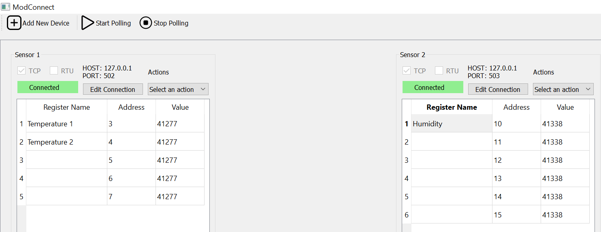

# Modbus Tool using Pyqt5.
Developing a user-friendly Modbus tool that helps users to interface with several Modbus slave devices at once, allowing effortless reading from and writing to their respective Modbus addresses.

# General Features
1. Connect to **multiple** Modbus TCP/IP servers.

2. Connect to **multiple** Modbus RTU servers using the RS485 communication protocols.

3. Read **coils**, **discrete inputs**, **holding registers**.

5. Write **single coil**, **multiple coils** and **single registers**.

# UI Features
1.  **Device Creation Simplification**: Streamlined process for creating Modbus devices within the application, facilitating quick setup and configuration.
    
2.  **Efficient Register Management**: Seamless integration for adding and managing registers within a device, enabling straightforward organization and access to device data.
 
3.  **Custom Device Labeling**: Ability to assign personalized labels or names to individual devices, enhancing clarity and usability when working with multiple devices.
    
4.  **Device Configuration Persistence**: Capability to save configured devices for later use, allowing users to store and recall device configurations effortlessly, thereby promoting efficiency and convenience in repetitive tasks


# Windows Prerequisites.
1. **Python:** Version 3.8 or later. Download it from [here.](https://www.python.org/)
2. **pip:** Pip is included with Python starting from Python 3.4.
3. **git:** Download git from [here.](https://git-scm.com/downloads)

# Python module requirements.
* PyQt5>=5.15.10
* pymodbus>=3.6.2
* pyserial>3.5

The above python modules will be automatically installed in step 2 of the Installation Guide below.


# Installation

1.  Clone this repository:
 ```
 git clone https://github.com/Kneatrum/Modbus-PyQt-App.git
 ```
2. Install dependencies:
 ```
 pip install -r requirements.txt
 ```

# Usage

   ### Run the application:
```
python main.py
```
   ### Adding a device.
   * Click on <kbd>Add New Device</kbd> button
   * Select either of the methods TCP or RTU that show up on the popup window. If a device has both RTU and TCP methods, you can check both the TCP and RTU checkboxes and select your default method later.
   * Fill out the form and click on submit.
   ### Adding modbus registers.
   * Click on the Actions dropdown menu and and select the <kbd>Add Registers</kbd> option.
   * Select the appropriate function code.
   * Enter the start register address on the <kbd>Register Address</kbd> text field.
   * Enter the quantity of the registers on the <kbd>Quantity</kbd> text field.
   * Click on the <kbd>Submit</kbd> button.
   ### Connect to your device
   * Click on the <kbd>Select Action</kbd> dropdown menu and select the <kbd>Connect</kbd> option. The Gray <kbd>Disconnected</kbd> label should turn to <kbd>Connected</kbd> with a green background if the connection is successful.
   * Make sure that all your devices are connected if you have several.
   ### Start reading register data.
   * Click on the <kbd>Start Polling</kbd> button on the to left side of the screen.
   ### Stop polling
   * Click on the <kbd>Stop Polling</kbd> button.


# Screenshot
